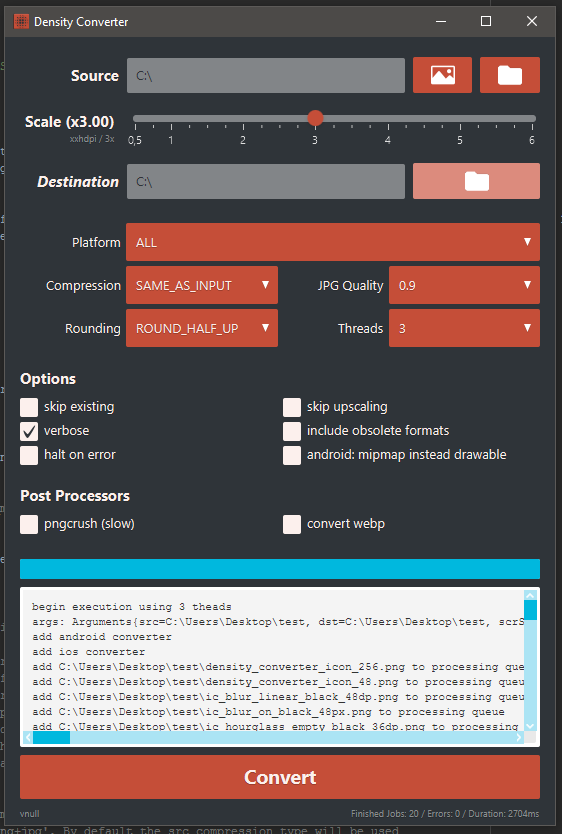

#  Density Image Converter Tool for Android and iOS

This is a simple tool that helps **converting single or batches of images** to **Android** and **iOS** specific formats and density
versions given the base scale. It has a **graphical** and **command line** interface and supports changing of compression types
(e.g. png -> jpeg). Using advanced scaling algorithms, it is designed to make conversion of images easy and fast while keeping the image quality high.

Usage:

```
java -jar ./dconvert.jar -src "C:/your-folder/image-folder" -scale 3
```

or

```
java -jar ./dconvert.jar
```

will start the UI (or double click the jar file).

**[Download here](https://github.com/patrickfav/density-converter/releases/)**

# Details

This tool is based on the idea that a developer gets the 'master' image in the highest needed resolution for his platform,
e.g. xxxhdpi (x4) in Android. He then proceeds to generate every other density with it. This tool exist to make this step as
easy and fast as possible.

To better understand, here is a practical example for Android: Source file is `ic_my_icon.png` in density xxxhdpi with resolution 144x144 (this will be 36dp x 36dp).
The tool will generated the following images in the following resolutions:
```
* mdpi 36x36 (x1)
* hdpi 54x54 (x1.5)
* xhdpi 72x72 (x2)
* xxhdpi 108x108 (x3)
* xxxhdpi 144x144 (x4)
```
To further optimize the output post processors can be used (see section below). This tool supports processing single files
or batches that are in a folder. Batch mode only processes direct child files and will NOT recursively search for images.

## Command Line

Continuing the above example of a xxxhdpi (x4) icon:

```
java -jar ./dconvert.jar -src "C:/master-image/ic_my_icon.png" -scale 4 -platform android
```

Will generate mdpi, hdpi, etc. folders in "C:/master-image/" containing the resized images

Full list of arguments:

    -androidIncludeLdpiTvdpi           Android only: If set will include additional densities (ldpi and
                                       tvdpi).
    -androidMipmapInsteadOfDrawable    Android only: creates mipmap sub-folders instead of drawable.
    -antiAliasing                      Anti-aliases images creating a little more blurred result; useful for
                                       very small images
    -compressionQuality <0.0-1.0>      Only used with compression 'jpg' sets the quality [0-1.0] where 1.0 is
                                       the highest quality. Default is 0.9
    -dst <path>                        The directory in which the converted files will be written. Will use
                                       the source folder if this argument is omitted.
    -enablePngCrush                    Will post-process all pngs with pngcrush. The executable must be set in
                                       the system path as 'pngcrush' i.e executable from every path. Pngcrush
                                       is a tool to compress pngs. Requires v1.7.22+
    -gui                               Starts graphical user interface
    -h,--help                          This help page
    -haltOnError                       If set will stop the process if an error occurred during conversion
    -outCompression <png|jpg>          Sets the compression of the converted images. Can be 'png', 'jpg',
                                       'gif' or 'png+jpg'. By default the src compression type will be used
                                       (e.g. png will be re-compressed to png after scaling).
    -platform <all|android|ios>        Can be 'all', 'android' or 'ios'. Sets what formats the converted
                                       images will be generated for. E.g. set 'android' if you only want to
                                       convert to android format. Default is ALL
    -postWebpConvert                   Will additionally convert all png/gif to lossless wepb and all jpg to
                                       lossy webp with cwebp. Does not delete source files. The executable
                                       must be set in the system path as 'cwebp' i.e executable from every
                                       path. cwebp is the official converter from Google.
    -roundingMode <round|ceil|floor>   Defines the rounding mode when scaling the dimensions. Possible options
                                       are 'round' (rounds up of >= 0.5), 'floor' (rounds down) and 'ceil'
                                       (rounds up). Default is ROUND_HALF_UP
    -scale <float>                     The source scrScale factor (1,1.5,2,3,4,etc.), ie. the base scrScale
                                       used to calculate if images need to be up- or downscaled. Ie. if you
                                       have the src file in density xxxhdpi you pass '4'. This argument is
                                       mandatory.
    -skipExisting                      If set will not overwrite a already existing file
    -skipUpscaling                     If set will only scale down, but not up to prevent image quality loss
    -src <path to file or folder>      The source. Can be an image file or a folder containing image files to
                                       be converted. This argument is mandatory.
    -threads <1-8>                     Sets the count of max parallel threads (more is faster but uses more
                                       memory). Possible values are 1-8. Default is 3
    -v,--version                       Gets current version
    -verbose                           If set will log to console more verbose


## GUI

Start with

```
java -jar ./dconvert.jar
```

provides the same features as the command line tool so see manpages.



## Post Processors

The converter tool supports some post processors which run after the main conversation task to manipulate the resulting files.
Post processors can be easily implemented by implementing the `PostProcessor` interface.

### pngcrush

Pngcrush is a brute force png compression tool. This may be already in your build chain (Android does this automatically),
but may be useful if not. Will run pngcrush over the all converted *.png files. See code or output for specific used options.

The converter tool requires `pngcrush` to be in PATH. Minimal required version is 1.7.22; currently tested with v1.7.87 & 1.8.0.
[More info on the pngcrush wesbite](http://pmt.sourceforge.net/pngcrush/)

### webp

WebP is an image format employing both lossy and lossless compression developed by Google. It is natively supported in Android
and claims to be 25-35% smaller in file size than png and jpeg (in their respected categories).

If the flag is set the converter tool will compress jpegs to lossy webp and png/gif to lossless version of it. The program
 `cwebp`, which can be downloaded from [Google's page](https://developers.google.com/speed/webp/docs/cwebp), must be set in PATH variable.

[More info on the webp](https://developers.google.com/speed/webp/)

## Implementation Details

Java 1.8, JavaFx and Apache CLI

Rescaling happens with imgscalr which includes some sophisticated algorithms for correct resizing using ULTRA_QUALITY setting.

For parallel execution, every source file spawns his own thread for each platform converter e.g. 3 files 2 converters -> 6 threads needed.

The tool can easily be extended by using the `IPlatformConvert` and `PostProcessor` interfaces.

Both user interfaces use the same underlying logic.

## Limitations & Known Issues

* There is no specific support for Android 9-patches ([see this project](https://github.com/redwarp/9-Patch-Resizer))

## How to build

Build with maven

```
mvn clean package
```

The .jar file will be in the generated `/target` folder

# About

## Credits

* HQ image resizing with [imgscalr](https://github.com/thebuzzmedia/imgscalr)
* JavaFx theme based on Flatter by [hendrikebbers](https://github.com/guigarage/javafx-collection/tree/master/flatter)
* Image file icon: Icon made by [Freepik](http://www.freepik.com/)

## License

[Apache License, Version 2.0](http://www.apache.org/licenses/LICENSE-2.0)